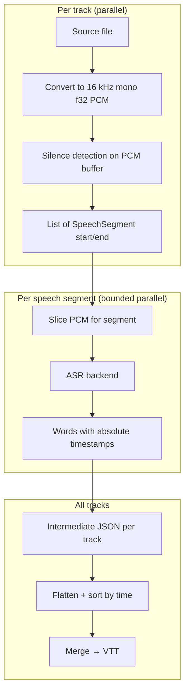

# superscribe

Transcribe multi-track podcast recordings into a single time-aligned VTT file (SRT, JSON, and TXT planned). Each speaker is recorded on an isolated audio track; superscribe transcribes every track in parallel on-device, aligns the results on a shared timeline, resolves overlaps, and merges them into a subtitle file ready for editing or publishing.

Core logic lives in **SuperscribeKit**, a Swift library you can import from your own macOS apps; the `superscribe` CLI is a thin wrapper around it.

## Requirements

- macOS 14 or later
- Apple Silicon (M1 or later) — both backends use Neural Engine / Metal GPU acceleration
- Swift 6.2 (Xcode 16.3 or later)
- `cmake` and `ninja` — required once to build the whisper.cpp xcframework (`brew install cmake ninja`)

## Quick start

```sh
# 1. Build the whisper.cpp static xcframework (one-time, ~2 min)
./_scripts/build-whisper.sh

# 2. Build superscribe
swift build -c release

# 3. Transcribe two tracks and produce a VTT file
.build/release/superscribe run \
  --track Alice=alice.wav \
  --track Bob=bob.wav \
  --language en \
  > transcript.vtt
```

Models download automatically on first use. Progress is shown on stderr.

Check the version with `superscribe --version` (currently **0.7.11**).

## Speech detection and time-sliced transcription

Most transcription tools assume a single mixed recording and run the recognizer over the entire file. **superscribe is built for multi-track podcast production:** each guest or host is recorded on an isolated track, so speaker identity comes from the file mapping — no diarization step, no guessing who spoke when.

The second major difference is **silence-aware time slicing.** Long stretches of a track are often silent (a guest who is not talking, room tone between takes, music beds on other channels). Running ASR on those regions wastes time and can produce hallucinated text from noise. superscribe scans each track first, finds where speech actually occurs, and sends **only those windows** to the model. Word timestamps are mapped back onto the full episode timeline so merge still produces one coherent subtitle file.

### End-to-end flow



1. **Convert** — Each track is read through AVFoundation and normalized to the backend format (today: **16 kHz, mono, 32-bit float PCM**). Conversion can be cached under `~/.cache/superscribe/audio/` so repeat runs skip re-decoding.
2. **Detect** — The same PCM buffer is analyzed for speech spans (`Analyzer` in `Sources/SuperscribeKit/Analyzer.swift`). Boundaries are in **seconds on the full track timeline**, not relative to each slice.
3. **Slice and transcribe** — For each span, `AudioPreparer` copies the sample range, the backend runs inference on that chunk only, and token/word times are shifted by the segment’s `start` so they line up with the original recording.
4. **Merge** — Per-track JSON is combined chronologically across speakers (overlap policies, paragraph breaks, cue formatting). Silence detection does not run again at merge time.

Tracks are processed independently in phase 1 (conversion + detection). Phase 2 transcribes segments with bounded concurrency (default **2** concurrent ASR calls) to stay within Neural Engine / GPU limits.

### Why isolated tracks plus slicing matters

| Approach | Speaker attribution | Silent regions |
|---|---|---|
| Single mixed file + diarization | Model must infer who spoke | Full duration transcribed |
| **superscribe (per-track + slicing)** | Track name = speaker | Skipped before ASR |

Example: a 45-minute episode with two hosts might have a 40-minute “Alice” file where she speaks for 12 minutes and a “Bob” file that is mostly silence until his segment. Diarization on a mix still processes ~45 minutes of audio; superscribe might run ASR on ~12 + ~8 minutes total across both tracks.

### Silence detection algorithm

Detection is **energy-based**, not ML-based: fast, deterministic, and tunable from the CLI. It operates on the **converted** PCM (same sample rate the recognizer uses), so slice boundaries match what the backend actually hears.

**Step 1 — Windowed RMS.** The buffer is scanned in non-overlapping windows (default **1024 samples** → **64 ms** at 16 kHz). For each window the root-mean-square level is computed. The CLI threshold `--silence-threshold` (default **−40 dB**) is converted to a linear amplitude; windows at or above that level count as **speech**, below as **non-speech**.

**Step 2 — Raw speech regions.** A simple state machine walks the windows: transitions from non-speech to speech open a region; transitions back close it. Adjacent speech windows become one contiguous raw region in sample indices.

**Step 3 — Merge short gaps.** Regions separated by less than `--min-silence` (default **0.5 s**) are merged into a single segment. Brief pauses inside a sentence therefore do not split transcription into dozens of tiny calls.

**Step 4 — Padding.** Each merged region is expanded by `--padding` (default **0.15 s**) before and after, then clamped to `[0, track duration]`. Padding reduces clipped plosives and trailing consonants at segment edges.

**Step 5 — Drop noise bursts.** Regions shorter than **0.1 s** (`minSegmentDuration` in code, not exposed on the CLI) are discarded as clicks or glitches.

The result is an ordered list of `SpeechSegment` values `{ start, end }` in seconds. When you transcribe, superscribe writes an **intermediate transcript** (default `transcript.superscribe.<backend>.json`). Its `metadata` block includes an `analyzer` object with `silence_threshold_db`, `min_silence`, and `padding` so you can see exactly which detection settings were used when you merge later.

### Time slicing and timestamp alignment

For each `SpeechSegment`:

1. **Slice** — `AudioPreparer.slice` maps `start`/`end` to sample indices at 16 kHz and copies that subrange from the full-track buffer.
2. **Transcribe** — The backend receives only those samples. Parakeet and whisper.cpp both return token- or word-level times **relative to the start of the slice** (offset 0).
3. **Re-anchor** — Superscribe adds the segment’s `start` time to every word (via `TokenAccumulator` / result mapping) so the intermediate file uses **absolute** times on the track clock — the same clock used when merging multiple speakers into one timeline.

Segment boundaries in the JSON (`start` / `end`) come from the analyzer; word timestamps usually sit inside that range but can extend slightly when the model’s internal alignment differs from the energy detector.

### What gets omitted

After transcription, the pipeline drops:

- **Segments with no words** — e.g. breath, FX, or music that crossed the RMS threshold but produced no ASR output.
- **Entire tracks with no surviving segments** — typical for FX or noise-only stems.

Those tracks do not appear in the intermediate transcript. This keeps merge output clean but means very quiet speech or heavily compressed audio may need a lower `--silence-threshold` (less negative, e.g. `−35`) or more `--padding`.

### Tuning flags (`transcribe` / `run`)

| Flag | Default | Effect |
|---|---|---|
| `--silence-threshold` | `−40` dB | Lower (e.g. `−50`) = more sensitive, more segments; higher (e.g. `−30`) = stricter, fewer segments |
| `--min-silence` | `0.5` s | Require a longer gap before splitting one speech region into two |
| `--padding` | `0.15` s | Extra audio included before/after each detected region |
| `--verbose` | off | Per-segment progress on stderr (`segment 3/12`, overall counts) |

Studio vocals on isolated tracks often work well at the defaults. Noisy rooms, distant mics, or bleed from other speakers may need a lower threshold. Very dense back-and-forth with short pauses may need a smaller `--min-silence` so turns split into separate ASR calls (more accurate boundaries, more overhead).

### Library entry points

| Component | Role |
|---|---|
| `Analyzer` / `AnalyzerConfig` | Speech span detection |
| `AudioPreparer` | Convert, cache, and slice PCM |
| `TranscribePipeline` | Orchestrates detect → slice → transcribe |
| `Merger` | Cross-speaker timeline (separate from detection) |

Implementations: `Sources/SuperscribeKit/Analyzer.swift`, `AudioPreparer.swift`, `Pipeline.swift`, `Merger.swift`.

## Backends

| Name | Flag | Default model | Notes |
|---|---|---|---|
| Parakeet (FluidAudio) | `parakeet` | `v3` | CoreML / Neural Engine; fast, low power |
| whisper.cpp | `whisper.cpp` | `large-v3-turbo` | GGML `.bin`; Core ML encoder on ANE when installed, Metal fallback; Metal decoder |
| Apple Speech | `apple-speech` | — | Reserved, not yet implemented |

Parakeet is the default backend. Switch per run with `--backend whisper.cpp`, or set a permanent default:

```sh
superscribe backend --set-default whisper.cpp
superscribe model --set-default large-v3-turbo --backend whisper.cpp
```

### Parakeet models

| Id | Description |
|---|---|
| `v3` | Multilingual TDT (default) |
| `v2` | English-only TDT |
| `tdt-ctc-110m` | Compact 110M CTC model |
| `tdt-ja` | Japanese |

### whisper.cpp models

Any `ggml-<name>.bin` from the [whisper.cpp Hugging Face repo](https://huggingface.co/ggerganov/whisper.cpp) — e.g. `large-v3-turbo`, `base`, `medium-q5_0`. Quantized ids keep the quant suffix; the Core ML encoder bundle uses the base name (e.g. `medium-q5_0` → `ggml-medium-encoder.mlmodelc.zip`).

## Configuration and storage

User defaults (backend, model) persist to `~/.config/superscribe/config.json`.

| What | Location |
|---|---|
| User config | `~/.config/superscribe/config.json` |
| Remote model catalog cache | `~/.cache/superscribe/catalog.json` |
| Converted audio cache | `~/.cache/superscribe/audio/` |
| Parakeet models | `~/Library/Application Support/FluidAudio/Models/<folder>/` |
| whisper.cpp GGML weights | `~/Library/Caches/superscribe/whisper/<id>.bin` |
| whisper.cpp Core ML encoder | `~/Library/Caches/superscribe/whisper/<base>-encoder.mlmodelc/` (auto-downloaded with the `.bin`) |

## Subcommands

### `transcribe`

Detects speech, runs ASR on each track, and writes an intermediate `transcript.superscribe.<backend>.json` file. See [Speech detection and time-sliced transcription](#speech-detection-and-time-sliced-transcription) for how detection, slicing, and timestamps work.

```sh
superscribe transcribe \
  --track Alice=alice.flac \
  --track Bob=bob.flac \
  --language de \
  --backend whisper.cpp \
  --model large-v3-turbo
```

| Option | Default | Description |
|---|---|---|
| `--track name=path` | — | Speaker track; repeatable (required unless `--input`) |
| `--input file` | — | Load track mapping JSON from `--create-input` |
| `--create-input dir` | — | Scan directory → write `tracks.superscribe.json` in cwd |
| `--backend` | configured default | `parakeet` or `whisper.cpp` |
| `--model` | configured default | Model variant (see [Backends](#backends)) |
| `--language` | auto-detect | ISO language code (e.g. `en`, `de`, `ja`) |
| `--prompt` | — | Context hint to bias recognition |
| `--output` | `transcript.superscribe.<backend>.json` | Intermediate file path |
| `--silence-threshold` | `-40.0` dB | Silence detection threshold |
| `--min-silence` | `0.5` s | Minimum gap to count as silence |
| `--padding` | `0.15` s | Padding around speech segments |
| `--verbose` | off | Per-segment progress on stderr |
| `--no-cache` | off | Disable the audio conversion cache |

**Directory workflow**

```sh
# Scan a directory and create tracks.superscribe.json in the current directory
superscribe transcribe --create-input /path/to/recordings

# Rename speakers in tracks.superscribe.json, then transcribe
superscribe transcribe --input tracks.superscribe.json --language de
```

Example mapping file:

```json
{
  "speaker-1": "recordings/alice.flac",
  "speaker-2": "recordings/bob.flac"
}
```

### `merge`

Merge an intermediate file into formatted output without re-transcribing.

```sh
superscribe merge transcript.superscribe.whisper.cpp.json \
  --format vtt \
  --overlap-policy preserve \
  > transcript.vtt
```

| Option | Default | Description |
|---|---|---|
| `--format` | `vtt` | `vtt` today; `srt`, `json`, `txt` planned |
| `--merge-output` | stdout | Output file path |
| `--overlap-policy` | `preserve` | `preserve`, `trim`, or `interleave` |
| `--gap-threshold` | `3.0` s | Paragraph breaks at longer pauses |
| `--max-cue-duration` | — | Split cues longer than this |
| `--max-line-length` | — | Wrap long cue text at this character count |
| `--include-words` | off | Embed word-level timestamps in VTT |

### `run`

Transcribe and merge in one pass. Accepts all options from `transcribe` and `merge`.

```sh
superscribe run \
  --track Alice=alice.wav \
  --track Bob=bob.wav \
  --language en \
  --format vtt \
  > transcript.vtt
```

Add `--keep-intermediate` to also save the `transcript.superscribe.<backend>.json` file.

### `model`

List, download, and manage models. `--list` is the default when no other verb is given.

```sh
# Installed models for the configured backend
superscribe model

# Remote catalog (cached from Hugging Face)
superscribe model --remote --backend whisper.cpp

# Refresh the catalog cache, then list
superscribe model --refresh --remote

# Download / remove
superscribe model --download medium-q5_0 --backend whisper.cpp
superscribe model --rm medium-q5_0 --backend whisper.cpp --yes

# Defaults and machine-readable output
superscribe model --set-default v3 --backend parakeet
superscribe model --json --remote
```

| Option | Description |
|---|---|
| `--backend` | Target backend (defaults to configured backend) |
| `--list` | List models (implicit default) |
| `--remote` | Include remote catalog entries |
| `--refresh` | Re-fetch remote catalog before listing |
| `--download <id>` | Download a model by id |
| `--rm <id>` | Remove an installed model (`--yes` to skip confirmation) |
| `--set-default <id>` | Set the default model for the backend |
| `--json` | JSON output (with `--list` only) |

Downloads show live progress on stderr. Installs are atomic (stage-then-rename).

### `backend`

List backends, set the default, or show capabilities.

```sh
superscribe backend
superscribe backend --set-default parakeet
superscribe backend --capabilities   # alias: --caps
```

### `cache`

Manage the converted-audio PCM cache (`~/.cache/superscribe/audio/`). Both backends share the same cache entry per source file (16 kHz mono f32).

```sh
superscribe cache              # location, entry count, total size
superscribe cache --list      # one line per entry (digest, size, age)
superscribe cache --rm /path/to/recording.flac
superscribe cache --clear      # prompts [y/N]
superscribe cache --clear --yes
```

## Intermediate format

`transcribe` writes a `transcript.superscribe.<backend>.json` file with raw per-track results. Tracks with no speech and segments with no words are omitted.

```json
{
  "version": 1,
  "created": "2026-05-18T17:09:30Z",
  "metadata": {
    "backend": "whisper.cpp",
    "model": "large-v3-turbo",
    "analyzer": {
      "silence_threshold_db": -40,
      "min_silence": 0.5,
      "padding": 0.15
    }
  },
  "tracks": [
    {
      "speaker": "Alice",
      "file": "/path/to/alice.flac",
      "segments": [
        {
          "start": 1.24,
          "end": 3.80,
          "words": [
            { "text": "Hello", "start": 1.24, "end": 1.56 },
            { "text": "world", "start": 1.60, "end": 2.10 }
          ]
        }
      ]
    }
  ]
}
```

## Using SuperscribeKit in a Swift app

Add the package to your `Package.swift` and import `SuperscribeKit`:

```swift
import SuperscribeKit

let pipeline = Pipeline(config: PipelineConfig(...))
// See Sources/SuperscribeKit/ for Pipeline, Analyzer, Merger, backends, etc.
```

The CLI sources under `Sources/superscribe/` demonstrate wiring backends, model install, and formatters.

## Building the whisper.cpp xcframework

The xcframework is not in the repository (gitignored). Build it once before the first `swift build`:

```sh
./_scripts/build-whisper.sh
```

The script downloads whisper.cpp v1.7.5, compiles with CMake/Ninja for `arm64` with **Metal and Core ML in a single static archive**, and produces `whisper-build/whisper.xcframework`. Re-running is a no-op if the xcframework already exists. After upgrading superscribe when the whisper build changes, delete `whisper-build/` and re-run.

The first transcription with a newly installed Core ML encoder bundle may be slow while macOS compiles the graph for the Neural Engine.

## Project structure

```
Sources/
  SuperscribeKit/          Core library (importable by Swift apps)
    Backends/              ParakeetBackend, WhisperBackend (+ registries, LiveAPI)
    Format/                VTTFormatter
    Analyzer.swift         Silence detection
    AudioPreparer.swift    Audio conversion + slicing (16 kHz mono f32 PCM)
    ConvertedAudioCache.swift
    ModelDownloader.swift  Hugging Face downloads with progress
    ModelInstaller.swift   Atomic install + whisper encoder bundles
    Pipeline.swift         Conversion + transcription orchestration
    ...
  superscribe/             CLI executable (one file per subcommand)
    TranscribeCommand.swift, MergeCommand.swift, RunCommand.swift
    ModelCommand.swift, BackendCommand.swift, CacheCommand.swift
    BackendManager.swift, ModelManager.swift, Options.swift, ...
Tests/superscribeTests/    Swift Testing suite
_scripts/
  build-whisper.sh         xcframework build (one-time)
  test.sh                  Serial test runner (recommended)
  coverage.sh              100% SuperscribeKit line + region coverage gate
```

## Development

Swift Testing parallelizes suites by default; this project uses shared hooks and path overrides, so run tests **serially**:

```sh
_scripts/test.sh
# or:
swift test --no-parallel -Xswiftc -strict-concurrency=complete
```

Plain `swift test` (parallel) can flake on hook/network mock tests.

Coverage gate (SuperscribeKit line **and** region coverage must stay at 100%):

```sh
_scripts/coverage.sh --run-tests
```

## License

MIT — see [LICENSE](LICENSE).
