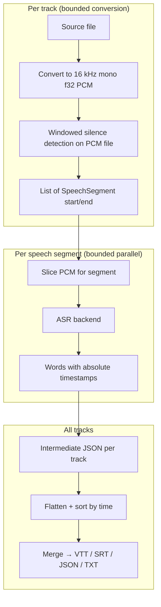

# superscribe

Transcribe multi-track podcast recordings into time-aligned VTT, SRT, JSON, or TXT output. Each speaker is recorded on an isolated audio track; superscribe transcribes every track in parallel on-device, aligns the results on a shared timeline, resolves overlaps, and merges them into a subtitle file ready for editing or publishing.

Core logic lives in **SuperscribeKit**, a Swift library you can import from your own macOS apps; the `superscribe` CLI is a thin wrapper around it.

## Requirements

- macOS 14 or later
- Apple Silicon (M1 or later) — Parakeet and whisper.cpp use Neural Engine / Metal GPU acceleration
- macOS 26 or later — required only for the **Apple Speech** backend (`appleSpeech`); Parakeet and whisper.cpp run on macOS 14+
- Swift 6.2 or later (Xcode 26 or later)
- `cmake` and `ninja` — required once to build the whisper.cpp xcframework (`brew install cmake ninja`)

## Quick start

```sh
# 1. Build the whisper.cpp static xcframework (one-time, ~2 min)
./_scripts/bootstrap.sh

# 2. Build superscribe
swift build -c release

# 3. Transcribe two tracks and produce a VTT file
"$(swift build -c release --show-bin-path)/superscribe" run \
  --track Alice=alice.wav \
  --track Bob=bob.wav \
  --language en \
  > transcript.vtt
```

Parakeet and whisper.cpp models download automatically on first use (progress on stderr). Apple Speech requires macOS 26+ and also installs locale assets automatically on first use; `model --download` is optional when you want to pre-install a model or locale.

Check the version with `superscribe --version` (currently **1.0.1**).

## Speech detection and time-sliced transcription

Most transcription tools assume a single mixed recording and run the recognizer over the entire file. **superscribe is built for multi-track podcast production:** each guest or host is recorded on an isolated track, so speaker identity comes from the file mapping — no diarization step, no guessing who spoke when.

The second major difference is **silence-aware time slicing.** Long stretches of a track are often silent (a guest who is not talking, room tone between takes, music beds on other channels). Running ASR on those regions wastes time and can produce hallucinated text from noise. superscribe scans each track first, finds where speech actually occurs, and sends **only those windows** to the model. Word timestamps are mapped back onto the full episode timeline so merge still produces one coherent subtitle file.

### End-to-end flow


```mermaid
flowchart TB
  subgraph per_track ["Per track (bounded conversion)"]
    A[Source file] --> B[Convert to 16 kHz mono f32 PCM]
    B --> C[Windowed silence detection on PCM file]
    C --> D["List of SpeechSegment start/end"]
  end
  subgraph transcribe ["Per speech segment (bounded parallel)"]
    D --> E[Slice PCM for segment]
    E --> F[ASR backend]
    F --> G[Words with absolute timestamps]
  end
  subgraph merge_phase ["All tracks"]
    G --> H[Intermediate JSON per track]
    H --> I[Flatten + sort by time]
    I --> J[Merge → VTT / SRT / JSON / TXT]
  end
```

1. **Convert** — Each track is read through AVFoundation and normalized to the backend format (today: **16 kHz, mono, 32-bit float PCM**). Conversion can be cached under `~/.cache/superscribe/audio/` so repeat runs skip re-decoding.
2. **Detect** — The prepared PCM file is analyzed in bounded windows for speech spans (`Analyzer` in `Sources/SuperscribeKit/Analyzer.swift`). Boundaries are in **seconds on the full track timeline**, not relative to each slice.
3. **Slice and transcribe** — For each span, `AudioPreparer` reads only the active segment samples, the backend runs inference on that chunk only, and token/word times are shifted by the segment’s `start` so they line up with the original recording.
4. **Merge** — Per-track JSON is combined chronologically across speakers (overlap policies, paragraph breaks, cue formatting). Silence detection does not run again at merge time.

Conversion and detection use at most **2** workers by default. PCM lives in cache files or temporary files that are removed when the pipeline exits. Segments across all tracks share one global limit of **2** concurrent ASR calls. A Whisper context has exclusive access on its own serial worker; it is never shared by concurrent C inference calls.

### Why isolated tracks plus slicing matters

| Approach | Speaker attribution | Silent regions |
|---|---|---|
| Single mixed file + diarization | Model must infer who spoke | Full duration transcribed |
| **superscribe (per-track + slicing)** | Track name = speaker | Skipped before ASR |

Example: a 45-minute episode with two hosts might have a 40-minute “Alice” file where she speaks for 12 minutes and a “Bob” file that is mostly silence until his segment. Diarization on a mix still processes ~45 minutes of audio; superscribe might run ASR on ~12 + ~8 minutes total across both tracks.

### Silence detection algorithm

Detection is **energy-based**, not ML-based: fast, deterministic, and tunable from the CLI. It operates on the **converted** PCM (same sample rate the recognizer uses), so slice boundaries match what the backend actually hears.

**Step 1 — Windowed RMS.** The buffer is scanned in non-overlapping windows (default **1024 samples** → **64 ms** at 16 kHz). For each window the root-mean-square level is computed. The CLI threshold `--silence-threshold` (default **−40 dB**) is converted to a linear amplitude; windows at or above that level count as **speech**, below as **non-speech**.

**Step 2 — Raw speech regions.** A simple state machine walks the windows: transitions from non-speech to speech open a region; transitions back close it. Adjacent speech windows become one contiguous raw region in sample indices.

**Step 3 — Merge short gaps.** Regions separated by less than `--min-silence` (default **0.5 s**) are merged into a single segment. Brief pauses inside a sentence therefore do not split transcription into dozens of tiny calls.

**Step 4 — Padding.** Each merged region is expanded by `--padding` (default **0.15 s**) before and after, then clamped to `[0, track duration]`. Padding reduces clipped plosives and trailing consonants at segment edges.

**Step 5 — Drop noise bursts.** Regions shorter than **0.1 s** (`minSegmentDuration` in code, not exposed on the CLI) are discarded as clicks or glitches.

The result is an ordered list of `SpeechSegment` values `{ start, end }` in seconds. When you transcribe, superscribe writes an **intermediate transcript** (default `transcript.superscribe.<backend>.json`). Its `metadata` block includes an `analyzer` object with `silence_threshold_db`, `min_silence`, and `padding` so you can see exactly which detection settings were used when you merge later.

### Time slicing and timestamp alignment

For each `SpeechSegment`:

1. **Slice** — `PreparedAudio.samples(in:)` maps `start`/`end` to sample indices and reads that subrange from the prepared file.
2. **Transcribe** — The backend receives only those samples. All backends return token- or word-level times **relative to the start of the slice** (offset 0).
3. **Re-anchor** — Superscribe adds the segment’s `start` time to every word (via `TokenAccumulator` / result mapping) so the intermediate file uses **absolute** times on the track clock — the same clock used when merging multiple speakers into one timeline.

Segment boundaries in the JSON (`start` / `end`) come from the analyzer; word timestamps usually sit inside that range but can extend slightly when the model’s internal alignment differs from the energy detector.

### What gets omitted

After transcription, the pipeline drops:

- **Segments with no words** — e.g. breath, FX, or music that crossed the RMS threshold but produced no ASR output.
- **Entire tracks with no surviving segments** — typical for FX or noise-only stems.

Those tracks do not appear in the intermediate transcript. This keeps merge output clean but means very quiet speech or heavily compressed audio may need a lower `--silence-threshold` (more negative, e.g. `−50`) or more `--padding`.

### Tuning flags (`transcribe` / `run`)

| Flag | Default | Effect |
|---|---|---|
| `--silence-threshold` | `−40` dB | Lower (e.g. `−50`) = more sensitive, more segments; higher (e.g. `−30`) = stricter, fewer segments |
| `--min-silence` | `0.5` s | Require a longer gap before splitting one speech region into two |
| `--padding` | `0.15` s | Extra audio included before/after each detected region |
| `--verbose` | off | Currently accepted but unused; conversion and segment progress are always shown on stderr |

Studio vocals on isolated tracks often work well at the defaults. Noisy rooms, distant mics, or bleed from other speakers may need a lower threshold. Very dense back-and-forth with short pauses may need a smaller `--min-silence` so turns split into separate ASR calls (more accurate boundaries, more overhead).

`transcribe` and `run` currently always emit progress on stderr: conversion lines such as `Converting alice.wav [42%]`, then segment lines such as `[Alice] segment 3/12  —  overall 7/18 (38%)`.

### Library entry points

| Component | Role |
|---|---|
| `Analyzer` / `AnalyzerConfig` | Speech span detection |
| `AudioPreparer` | Convert, cache, and slice PCM |
| `TranscribePipeline` | Orchestrates detect → slice → transcribe |
| `Merger` | Cross-speaker timeline (separate from detection) |

Implementations: `Sources/SuperscribeKit/Analyzer.swift`, `AudioPreparer.swift`, `TranscribePipeline.swift`, `Merger.swift`.

## Backends

| Name | Flag | Default model | Notes |
|---|---|---|---|
| Parakeet (FluidAudio) | `parakeet` | `v3` | CoreML / Neural Engine; fast, low power |
| whisper.cpp | `whisper.cpp` | `large-v3-turbo` | GGML `.bin`; Core ML encoder on ANE when installed, Metal fallback; Metal decoder |
| Apple Speech | `appleSpeech` | locale from system (e.g. `en-US`) | macOS 26+; system locale assets; no Hugging Face download |

Parakeet is the default backend. Switch per run with `--backend whisper.cpp` or `--backend appleSpeech`, or set a permanent default:

```sh
superscribe backend --set-default whisper.cpp
superscribe model --set-default large-v3-turbo --backend whisper.cpp
```

### Parakeet models

| Id | Description |
|---|---|
| `v3` | Multilingual TDT (default) |
| `v2` | English-only TDT |
| `tdt-ctc-110m` | Compact 110M CTC model |
| `tdt-ja` | Japanese |

The descriptor table is authoritative: unknown repositories and model identifiers are rejected.

### whisper.cpp models

Any `ggml-<name>.bin` from the [whisper.cpp Hugging Face repo](https://huggingface.co/ggerganov/whisper.cpp) — e.g. `large-v3-turbo`, `base`, `medium-q5_0`. Quantized ids keep the quant suffix; the Core ML encoder bundle uses the base name (e.g. `medium-q5_0` → `ggml-medium-encoder.mlmodelc.zip`).

### Apple Speech locales

Models are **BCP-47 locale ids** (e.g. `en-US`, `de-DE`). The default resolves `Locale.current` to a supported equivalent locale, then falls back to supported `en-US`. Locale is selected with `--model`, not `--language`. Apple manages assets via `AssetInventory`; superscribe auto-installs missing locales on first `transcribe` / `run`, and the `model` subcommand can pre-install or release them explicitly:

```sh
superscribe model --download en-US --backend appleSpeech
superscribe model --list --remote --backend appleSpeech
superscribe run \
  --track Alice=alice.wav \
  --backend appleSpeech \
  --model en-US \
  --format vtt \
  > transcript.vtt
```

Default intermediate output: `transcript.superscribe.appleSpeech.json`. The `metadata.backend` field uses the same string (`appleSpeech`).

On macOS versions below 26, `superscribe backend` shows `appleSpeech  (requires macOS 26+)`. The package still builds on macOS 14; selecting Apple Speech on an unsupported OS fails with a clear error.

`--prompt` is accepted on the CLI and stored in configuration, but it is ignored at Apple Speech inference time. Use `model --rm <locale> --backend appleSpeech` to release a locale allocation when you hit system limits.

`backend --capabilities` prints the resolved backend display name. For example, Parakeet appears as a concrete model family such as `Parakeet TDT v3 (FluidAudio)`.

## Configuration and storage

User defaults (backend, model) persist to `~/.config/superscribe/config.json`.

| What | Location |
|---|---|
| User config | `~/.config/superscribe/config.json` |
| Model catalog cache | `~/.cache/superscribe/catalog.json` (Parakeet/whisper from Hugging Face; Apple Speech from system locale APIs) |
| Converted audio cache | `~/.cache/superscribe/audio/` |
| Parakeet models | `~/Library/Application Support/FluidAudio/Models/<folder>/` |
| whisper.cpp GGML weights | `~/Library/Caches/superscribe/whisper/<id>.bin` |
| whisper.cpp Core ML encoder | `~/Library/Caches/superscribe/whisper/<base>-encoder.mlmodelc/` (auto-downloaded with the `.bin`) |
| Apple Speech locales | System-managed via `AssetInventory` (install marker: `apple-speech://locale/<id>`) |

## Subcommands

### `transcribe`

Detects speech, runs ASR on each track, and writes an intermediate `transcript.superscribe.<backend>.json` file. See [Speech detection and time-sliced transcription](#speech-detection-and-time-sliced-transcription) for how detection, slicing, and timestamps work.

```sh
superscribe transcribe \
  --track Alice=alice.flac \
  --track Bob=bob.flac \
  --language de \
  --backend whisper.cpp \
  --model large-v3-turbo
```

| Option | Default | Description |
|---|---|---|
| `--track name=path` | — | Speaker track; repeatable (required unless `--input` or `--create-input`) |
| `--input file` | — | Load track mapping JSON from `--create-input` |
| `--create-input dir` | — | Scan directory → write `tracks.superscribe.json` in cwd |
| `--backend` | configured default | `parakeet`, `whisper.cpp`, or `appleSpeech` |
| `--model` | configured default | Model variant (see [Backends](#backends)); Apple Speech locale id |
| `--language` | auto-detect | ISO language code (e.g. `en`, `de`, `ja`); does not affect `appleSpeech` recognition, but may appear in intermediate metadata |
| `--prompt` | — | Context hint for `whisper.cpp`; accepted but ignored for Parakeet and `appleSpeech` |
| `--output` | `transcript.superscribe.<backend>.json` | Intermediate path (`<backend>` is the raw flag value, e.g. `appleSpeech`) |
| `--silence-threshold` | `-40.0` dB | Silence detection threshold |
| `--min-silence` | `0.5` s | Minimum gap to count as silence |
| `--padding` | `0.15` s | Padding around speech segments |
| `--verbose` | off | Currently accepted but unused; progress is always shown on stderr |
| `--no-cache` | off | Disable the audio conversion cache |

**Directory workflow**

```sh
# Scan a directory and create tracks.superscribe.json in the current directory
superscribe transcribe --create-input /path/to/recordings

# Rename speakers in tracks.superscribe.json, then transcribe
superscribe transcribe --input tracks.superscribe.json --language de
```

`--create-input` scans regular files with these extensions: `mp3`, `wav`, `m4a`, `aac`, `flac`, `ogg`, `mp4`, `mov`, `caf`, `opus`.

Example mapping file:

```json
{
  "speaker-1": "recordings/alice.flac",
  "speaker-2": "recordings/bob.flac"
}
```

### `merge`

Merge an intermediate file into formatted output without re-transcribing.

```sh
superscribe merge transcript.superscribe.whisper.cpp.json \
  --format vtt \
  --overlap-policy preserve \
  > transcript.vtt
```

| Option | Default | Description |
|---|---|---|
| `--format` | `vtt` | `vtt`, `srt`, `json`, or `txt` |
| `--merge-output` | stdout | Output file path |
| `--overlap-policy` | format-dependent | `preserve` for VTT/SRT/JSON; `interleave` for TXT. Explicit `preserve` is invalid for TXT |
| `--gap-threshold` | `3.0` s | Paragraph breaks at longer pauses |
| `--max-cue-duration` | — | Split cues longer than this |
| `--max-line-length` | — | Greedy VTT/SRT wrapping by Swift character count; long words stay intact |
| `--include-words` | off | VTT inline timestamps, SRT word cues, or timestamped TXT words. JSON always keeps word timings |

### Output behavior

- **Preserve** retains overlapping segments in stable chronological order.
- **Trim** ends the earlier speaker's segment when the next competing speaker starts; crossing words are clamped and words starting beyond the boundary are dropped.
- **Interleave** orders every timed word exactly once, breaking ties by track, segment, and word input order, then groups consecutive same-speaker runs.
- Cue splitting prefers the latest sentence boundary within the duration limit, then the latest word boundary. An indivisible timed word/span may exceed the limit; no timing is fabricated.
- VTT escapes text and voice annotations and restricts inline timestamps to increasing times inside the cue. SRT uses numbered cues, comma milliseconds, and `[Speaker]` labels. Quantized cues always have positive duration.
- TXT writes `Speaker: text` runs with blank lines at paragraph breaks. With word output, each word is prefixed by `[HH:MM:SS.mmm]`.
- JSON emits a version-1 document with a `segments` array. Each segment has `speaker`, numeric-second `start`/`end`, `text`, `paragraphBreak`, `overlap`, and complete `words`. Keys are sorted deterministically.

`merge` and `run` use the same renderer. Invalid transcript versions, nonfinite timestamps, reversed intervals, and invalid numeric options throw before rendering. Absolute track mapping paths stay absolute; relative paths resolve against the current working directory.

### `run`

Transcribe and merge in one pass. Accepts `transcribe` and `merge` options **except** `--create-input` and `--input` (those are `transcribe`-only; use `--track` or run `transcribe` first).

```sh
superscribe run \
  --track Alice=alice.wav \
  --track Bob=bob.wav \
  --language en \
  --format vtt \
  > transcript.vtt
```

| Option | Default | Description |
|---|---|---|
| (transcribe options) | — | `--track`, `--backend`, `--model`, silence tuning, `--no-cache`, etc. |
| (merge options) | — | `--format`, `--overlap-policy`, `--gap-threshold`, `--include-words`, `--merge-output`, etc. |
| `--keep-intermediate` | off | Also write `transcript.superscribe.<backend>.json` (discarded by default) |

On `run`, `--output` only affects the intermediate JSON path when `--keep-intermediate` is set. Use `--merge-output <file>` to write the final rendered output without shell redirection.

### `model`

List, download, and manage models (or Apple Speech locales). `--list` is the default when no other verb is given.

```sh
# Installed models for the configured backend
superscribe model

# Remote catalog — Parakeet/whisper: Hugging Face (standalone --remote refreshes catalog.json)
superscribe model --remote --backend whisper.cpp

# Remote catalog — Apple Speech: system-supported locales (also cached)
superscribe model --remote --backend appleSpeech

# Refresh the remote catalog cache, then list
superscribe model --list --remote --refresh

# Download / remove
superscribe model --download medium-q5_0 --backend whisper.cpp
superscribe model --rm medium-q5_0 --backend whisper.cpp --yes
superscribe model --download de-DE --backend appleSpeech

# Defaults and machine-readable output
superscribe model --set-default v3 --backend parakeet
superscribe model --json --remote
```

| Option | Description |
|---|---|
| `--backend` | Target backend (defaults to configured backend) |
| `--list` | List models (implicit default) |
| `--remote` | Include remote catalog entries |
| `--refresh` | Re-fetch the catalog only; combine with `--list --remote` to refresh and print remote entries |
| `--download <id>` | Install a model (HF download or Apple Speech locale asset) |
| `--rm <id>` | Remove an installed model or release a locale (`--yes` to skip confirmation) |
| `--set-default <id>` | Set the default model for the backend |
| `--json` | JSON output for list operations (explicit `--list` or implicit default); invalid with `--download`, `--rm`, or `--set-default` |

Parakeet and whisper.cpp downloads show live byte progress on stderr and use atomic stage-then-rename installs. Apple Speech locale installs show asset progress and are system-managed via `AssetInventory`.

### `backend`

List backends, set the default, or show capabilities. Listing is the default when no other verb is given.

```sh
superscribe backend
superscribe backend --set-default parakeet
superscribe backend --set-default appleSpeech
superscribe backend --capabilities   # alias: --caps
```

| Option | Description |
|---|---|
| `--list` | List backends (implicit default) |
| `--set-default <backend>` | Persist default backend to config |
| `--capabilities` / `--caps` | Print audio format and default model for the configured backend |

`appleSpeech` is annotated with `(requires macOS 26+)` when the host OS is below 26.

### `cache`

Manage the converted-audio PCM cache (`~/.cache/superscribe/audio/`). All backends share the same cache entry per source file (16 kHz mono f32).

```sh
superscribe cache              # location, entry count, total size
superscribe cache --list      # one line per entry (size, age, source filename)
superscribe cache --rm /path/to/recording.flac
superscribe cache --clear      # prompts [y/N]
superscribe cache --clear --yes
```

## Intermediate format

`transcribe` writes a `transcript.superscribe.<backend>.json` file with raw per-track results. The `<backend>` segment matches the CLI flag value (`parakeet`, `whisper.cpp`, or `appleSpeech`). Tracks with no speech and segments with no words are omitted. A top-level `session` field may be present when set by library callers.

```json
{
  "version": 1,
  "created": "2026-05-18T17:09:30Z",
  "metadata": {
    "backend": "whisper.cpp",
    "model": "large-v3-turbo",
    "language": "en",
    "analyzer": {
      "silence_threshold_db": -40,
      "min_silence": 0.5,
      "padding": 0.15
    }
  },
  "tracks": [
    {
      "speaker": "Alice",
      "file": "/path/to/alice.flac",
      "segments": [
        {
          "start": 1.24,
          "end": 3.80,
          "words": [
            { "text": "Hello", "start": 1.24, "end": 1.56 },
            { "text": "world", "start": 1.60, "end": 2.10 }
          ]
        }
      ]
    }
  ]
}
```

## Using SuperscribeKit in a Swift app

Add the package to your `Package.swift` and import `SuperscribeKit`:

```swift
import SuperscribeKit

// Library callers are responsible for installing or preflighting models first.
// The CLI installs missing assets automatically before transcription.
let transcriber = try Backend.parakeet.makeTranscriber(model: "v3")
let config = PipelineConfig(
    tracks: [TrackInput(speaker: "Alice", file: audioURL)],
    backend: .parakeet,
    transcriptionConfig: TranscriptionConfig(language: "en", prompt: nil)
)
let pipeline = TranscribePipeline(
    transcriber: transcriber,
    config: config,
    audioCache: ConvertedAudioCache()
)
let transcript = try await pipeline.run()

let vtt = try TranscriptRenderer.render(
    transcript, configuration: RenderConfiguration(format: .vtt)
)
```

`audioCache` is opt-in for library callers; pass `ConvertedAudioCache()` to match the CLI default. See `Sources/SuperscribeKit/` for `TranscribePipeline`, `Analyzer`, `Merger`, and backends. The CLI under `Sources/superscribe/` demonstrates model install, `BackendManager`, and formatters.

## Building the whisper.cpp xcframework

The xcframework is not in the repository (gitignored). Build it once before the first `swift build`:

```sh
./_scripts/bootstrap.sh
```

The script downloads whisper.cpp v1.7.5, compiles with CMake/Ninja for `arm64` with **Metal and Core ML in a single static archive**, and produces `whisper-build/whisper.xcframework`. Re-running is a no-op if the xcframework already exists. After upgrading superscribe when the whisper build changes, delete `whisper-build/` and re-run.

The first transcription with a newly installed Core ML encoder bundle may be slow while macOS compiles the graph for the Neural Engine.

## Project structure

```
Sources/
  SuperscribeKit/          Core library (importable by Swift apps)
    Backends/              ParakeetBackend, WhisperBackend, AppleSpeechBackend (+ registries, LiveAPI)
    AppleSpeechAssetInstaller.swift  Locale install via AssetInventory
    Format/                VTT/SRT/TXT/JSON formatters and shared cue utilities
    Analyzer.swift         Silence detection
    AudioPreparer.swift    Audio conversion + slicing (16 kHz mono f32 PCM)
    ConvertedAudioCache.swift
    ModelDownloader.swift  Hugging Face downloads with progress
    ModelInstaller.swift   Atomic install + whisper encoder bundles + Apple Speech locales
    TranscribePipeline.swift  File-backed preparation and global scheduling
    ...
  superscribe/             CLI executable (one file per subcommand)
    TranscribeCommand.swift, MergeCommand.swift, RunCommand.swift
    ModelCommand.swift, BackendCommand.swift, CacheCommand.swift
    BackendManager.swift, ModelManager.swift, Options.swift, ...
Tests/superscribeTests/    Swift Testing suite
_scripts/
  bootstrap.sh             xcframework build (one-time)
  test.sh                  Serial test runner (recommended)
  coverage.sh              100% SuperscribeKit line + region coverage gate
```

## Development

Swift Testing parallelizes suites by default; this project uses shared hooks and path overrides, so run tests **serially**:

```sh
_scripts/test.sh
# or:
swift test --no-parallel -Xswiftc -strict-concurrency=complete
```

Plain `swift test` (parallel) can flake on hook/network mock tests.

Coverage gate (SuperscribeKit line **and** region coverage must stay at 100%):

```sh
_scripts/coverage.sh --run-tests
```

The gate excludes `WhisperLiveAPI.swift`, `AppleSpeechLiveAPI.swift`, and `AppleSpeechTranscriberBridge.swift`; those files isolate live C/Speech framework paths that require real models, macOS 26+ APIs, or system-managed assets. Unit tests exercise the coverable shims and stubs around them.

## License

MIT — see [LICENSE](LICENSE).

## Migration to 1.0

Parakeet construction validates model identifiers and now throws:

```swift
let backend = try ParakeetBackend(model: "v3")
```

Unknown models throw `UnsupportedModelError` instead of silently selecting v3.
Only supported Parakeet models are advertised in the remote catalog. The existing
short aliases remain accepted.

Unit tests run with `_scripts/coverage.sh --run-tests`, which records and verifies
the binary/profile pair and owned source inputs before enforcing 100% line and region coverage.
Hardware tests require an already installed model and an explicit audio fixture:

```sh
SUPERSCRIBE_INTEGRATION_TESTS=1 \
SUPERSCRIBE_INTEGRATION_AUDIO=/absolute/path/to/speech.wav \
SUPERSCRIBE_INTEGRATION_MODEL=v3 \
swift test --no-parallel --filter ParakeetIntegrationTests
```

Hardware results are separate from unit coverage. The default suite does not run
inference, reserve/release system Speech assets, or download ASR models.

Additional 1.0 API changes:

```swift
let configuration = try UserConfig.load()
try await UserConfig.update { $0.setDefaultModel("v3", for: .parakeet) }
try SuperscribeFS.atomicReplace(staging: stagingURL, final: finalURL, policy: .replaceExisting)
```

`ModelRegistry.installedModels()` is async when called through the protocol.
Corrupt configuration is preserved and reported instead of replaced with defaults.

Backend instances own model identity in 1.0. Remove the `model` argument from
`TranscriptionConfig` and add `try` to validated backend constructors, analyzer
entry points, merge/formatter calls, and model install-path resolution. Registry
methods are async through `Backend` and `ModelRegistry`:

```swift
let model = try await Backend.appleSpeech.resolveModelId()
let transcriber = try Backend.appleSpeech.makeTranscriber(model: model)
let installed = try await Backend.appleSpeech.installedModels()
let text = try TranscriptRenderer.render(transcript, configuration: .init(format: .txt))
```

Apple Speech registry entries distinguish installed assets from this application's
reservations using `ModelInstallationState`. Removing a locale releases the
reservation, including an incomplete installation; it does not delete system assets.

Use `AudioPreparer.prepare(url:)` and `PreparedAudio.samples(in:)` for bounded
file-backed audio. `loadAndConvert(url:)` remains an explicit whole-array convenience.
Set `PipelineConfig.maxConcurrentConversions` and `maxConcurrentTranscriptions`
to positive limits. The sample-array API requires mono audio and positive rates.

Explicit Whisper downloads repair missing published encoders and incomplete model
files. Existing installed binary transcription remains usable offline through
Metal fallback. Shared encoders remain until their last installed variant is removed.
Filesystem publication is atomic; configuration and cache/catalog transactions use
process-wide file locks. Unreadable audio caches are reconverted; corrupt user
configuration is preserved and reported.
