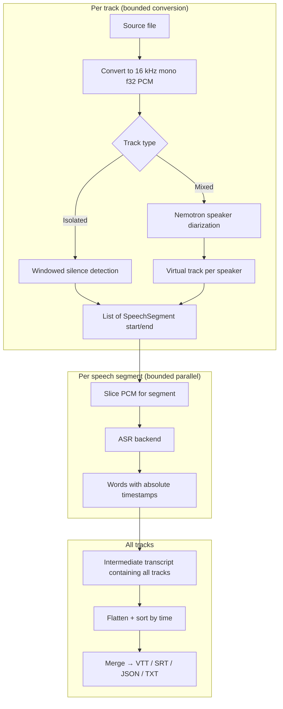

# superscribe

Transcribe podcast recordings into time-aligned VTT, SRT, JSON, or TXT output. Use isolated tracks for named speakers, mixed recordings with on-device speaker diarization, or both. superscribe transcribes speech segments in parallel, aligns the results on a shared timeline, and merges them into output ready for editing or publishing.

Core logic lives in **SuperscribeKit**, a Swift library you can import from your own macOS apps; the `superscribe` CLI is a thin wrapper around it.

## Requirements

Runtime:

- macOS 14 or later on Apple Silicon (M1 or later)
- macOS 26 or later for the **Apple Speech** backend (`appleSpeech`)

Building from source also requires:

- Swift 6.2 or later (Xcode 26 or later)
- `cmake` and `ninja` — required once to build the whisper.cpp xcframework (`brew install cmake ninja`)

## Quick start

```sh
# 1. Build the whisper.cpp static xcframework (one-time)
./_scripts/bootstrap.sh

# 2. Build superscribe
swift build -c release
export PATH="$(swift build -c release --show-bin-path):$PATH"

# 3. Transcribe two tracks and produce a VTT file
superscribe run \
  --track Alice=alice.wav \
  --track Bob=bob.wav \
  --language en \
  > transcript.vtt
```

Parakeet and whisper.cpp models download automatically on first use (progress on stderr). Apple Speech requires macOS 26+ and also installs locale assets automatically on first use; `model --download` is optional when you want to pre-install a model or locale.

The PATH change applies to the current shell. Check the installed version with `superscribe --version`.

## Speech detection and time-sliced transcription

For isolated tracks, speaker identity comes from the file mapping. For shared-microphone recordings, use `--mixed` to infer speakers; see [Mixed recordings](#mixed-recordings-speaker-diarization).

**Silence-aware time slicing** avoids running ASR over long silent stretches. superscribe uses energy-based detection on isolated tracks and speaker activity on mixed tracks, then transcribes only the resulting speech spans. Word timestamps are mapped back onto the full recording timeline.

### End-to-end flow


```mermaid
flowchart TB
  subgraph per_track ["Per track (bounded conversion)"]
    A[Source file] --> B[Convert to 16 kHz mono f32 PCM]
    B --> K{Track type}
    K -->|Isolated| C[Windowed silence detection]
    K -->|Mixed| L[Nemotron speaker diarization]
    C --> D["List of SpeechSegment start/end"]
    L --> M[Virtual track per speaker]
    M --> D
  end
  subgraph transcribe ["Per speech segment (bounded parallel)"]
    D --> E[Slice PCM for segment]
    E --> F[ASR backend]
    F --> G[Words with absolute timestamps]
  end
  subgraph merge_phase ["All tracks"]
    G --> H[Intermediate transcript containing all tracks]
    H --> I[Flatten + sort by time]
    I --> J[Merge → VTT / SRT / JSON / TXT]
  end
```

1. **Convert** — Each track is read through AVFoundation and normalized to the backend format (today: **16 kHz, mono, 32-bit float PCM**). Conversion can be cached under `~/.cache/superscribe/audio/` so repeat runs skip re-decoding.
2. **Detect or diarize** — Find speech spans using `Analyzer` for isolated tracks or `NemotronDiarizer` for mixed tracks. Boundaries are in **seconds on the full track timeline**, not relative to each slice.
3. **Slice and transcribe** — `PreparedAudio` reads the active segment samples, and the backend converts its slice-relative model timings to absolute track timestamps.
4. **Merge** — The intermediate transcript is combined chronologically across speakers (overlap policies, paragraph breaks, cue formatting). Detection and diarization do not run again at merge time.

Preparation (conversion plus detection or diarization) handles at most **2** input tracks at once by default. Cached PCM persists; uncached temporary PCM is removed when its final owner releases it. Segments across all tracks share one global limit of **2** concurrent ASR calls. A Whisper context has exclusive access on its own serial worker; it is never shared by concurrent C inference calls.

### Mixed recordings (speaker diarization)

A track passed with `--mixed path` (or marked `"diarize": true` in the mapping file) holds several speakers. Instead of silence detection, superscribe runs [NVIDIA Nemotron 3 Diarization](https://huggingface.co/nvidia/Nemotron-3-Diarization) on the Neural Engine via FluidAudio (Core ML, streaming `fast128` preset, up to **8** speakers):

1. The prepared 16 kHz PCM is streamed through the diarizer in 30-second windows, producing per-speaker probabilities every 10 ms.
2. Each frame goes to its most likely speaker at or above 0.5, so overlapping speech in the shared recording is transcribed once.
3. Turns are smoothed with the same `--min-silence`, `--padding`, and minimum-segment rules as silence detection; padding never crosses into a neighbor's turn.
4. Every diarized speaker becomes its own track in the intermediate transcript, so merging and all output formats work unchanged.

Name speakers in the mapping file with `"speakers"`, in order of first appearance; mapping two slots to the same name merges them. Unnamed speakers receive consecutive `Speaker 1…N` labels across all mixed tracks. Mixed and isolated tracks can be combined in one session.

```sh
superscribe run --mixed panel.wav --language en > panel.vtt
```

The diarizer model (~190 MiB, `FluidInference/nemotron-3-diarization-coreml`, OpenMDW-1.1) downloads into `~/.cache/superscribe/models/diarizer/` on the first mixed run, or ahead of time with `superscribe model --diarizer --download nemotron-3-diarization`.

### Silence detection algorithm

Detection is **energy-based**, not ML-based: fast, deterministic, and tunable from the CLI. It operates on the **converted** PCM (same sample rate the recognizer uses), so slice boundaries match what the backend actually hears.

**Step 1 — Windowed RMS.** The buffer is scanned in non-overlapping windows (default **1024 samples** → **64 ms** at 16 kHz). For each window the root-mean-square level is computed. The CLI threshold `--silence-threshold` (default **−40 dB**) is converted to a linear amplitude; windows at or above that level count as **speech**, below as **non-speech**.

**Step 2 — Raw speech regions.** A simple state machine walks the windows: transitions from non-speech to speech open a region; transitions back close it. Adjacent speech windows become one contiguous raw region in sample indices.

**Step 3 — Merge short gaps.** Regions separated by less than `--min-silence` (default **0.5 s**) are merged into a single segment. Brief pauses inside a sentence therefore do not split transcription into dozens of tiny calls.

**Step 4 — Padding.** Each merged region is expanded by up to `--padding` (default **0.15 s**) before and after, capped at half of the adjacent silence and clamped to `[0, track duration]`. Padding reduces clipped consonants without making neighboring segments overlap.

**Step 5 — Drop short segments.** Padded regions shorter than **0.1 s** (`minSegmentDuration` in code, not exposed on the CLI) are discarded.

The result is an ordered list of `SpeechSegment` values `{ start, end }` in seconds. When you transcribe, superscribe writes an **intermediate transcript** (default `transcript.superscribe.<backend>.json`). Its `metadata` block includes an `analyzer` object with `silence_threshold_db`, `min_silence`, and `padding` so you can see exactly which detection settings were used when you merge later.

### Time slicing and timestamp alignment

For each `SpeechSegment`:

1. **Slice** — `PreparedAudio.samples(in:)` maps `start`/`end` to sample indices and reads that subrange from the prepared file.
2. **Transcribe and re-anchor** — The backend receives only those samples and adds the segment’s `start` to model timings when mapping its result. The `Transcriber` API returns **absolute** word times on the track clock, which are stored directly in the intermediate file.

Segment boundaries in the JSON (`start` / `end`) come from detection or diarization. Word timestamps usually sit inside that range but can extend slightly when model alignment differs.

### What gets omitted

After transcription, the pipeline drops:

- **Segments with no words** — e.g. breath, FX, or music that crossed the RMS threshold but produced no ASR output.
- **Entire tracks with no surviving segments** — typical for FX or noise-only stems.

Those tracks do not appear in the intermediate transcript.

### Tuning detection

On isolated tracks, lower `--silence-threshold` (e.g. `-50`) if quiet speech is missed; raise it (e.g. `-30`) if noise or microphone bleed causes false detections. Reduce `--min-silence` to split at shorter pauses, or increase `--padding` to include more audio at segment edges. Mixed tracks use the diarizer's activity threshold, so `--silence-threshold` does not affect them; `--min-silence` and `--padding` still apply. See the [option reference](#transcribe) for defaults.

`transcribe` and `run` currently always emit progress on stderr: conversion lines such as `Converting alice.wav [42%]`, then segment lines such as `[Alice] segment 3/12  —  overall 7/18 (38%)`.

## Backends

| Name | Flag | Default model | Notes |
|---|---|---|---|
| Parakeet (FluidAudio) | `parakeet` | `v3` | CoreML / Neural Engine; fast, low power |
| whisper.cpp | `whisper.cpp` | `large-v3-turbo` | GGML `.bin`; Core ML encoder on ANE when installed, Metal fallback; Metal decoder |
| Apple Speech | `appleSpeech` | locale from system (e.g. `en-US`) | macOS 26+; system locale assets; no Hugging Face download |

Parakeet is the default backend. Switch per run with `--backend whisper.cpp` or `--backend appleSpeech`, or set a permanent default:

```sh
superscribe backend --set-default whisper.cpp
superscribe model --set-default large-v3-turbo --backend whisper.cpp
```

### Parakeet models

| Id | Description |
|---|---|
| `v3` | Multilingual TDT (default) |
| `v2` | English-only TDT |
| `tdt-ctc-110m` | Compact 110M TDT/CTC model |
| `tdt-ja` | Japanese |

Only these supported model families are offered in the catalog; unknown model identifiers are rejected.

### whisper.cpp models

Any `ggml-<name>.bin` from the [whisper.cpp Hugging Face repo](https://huggingface.co/ggerganov/whisper.cpp) — e.g. `large-v3-turbo`, `base`, `medium-q5_0`. Quantized ids keep the quant suffix; the Core ML encoder bundle uses the base name (e.g. `medium-q5_0` → `ggml-medium-encoder.mlmodelc.zip`).

### Apple Speech locales

Models are **BCP-47 locale ids** (e.g. `en-US`, `de-DE`). The default resolves `Locale.current` to a supported equivalent locale, then falls back to supported `en-US`. Locale is selected with `--model`, not `--language`. Apple manages assets via `AssetInventory`; superscribe auto-installs missing locales on first `transcribe` / `run`, and the `model` subcommand can pre-install or release them explicitly:

```sh
superscribe model --download en-US --backend appleSpeech
superscribe model --list --remote --backend appleSpeech
superscribe run \
  --track Alice=alice.wav \
  --backend appleSpeech \
  --model en-US \
  --format vtt \
  > transcript.vtt
```

Default intermediate output: `transcript.superscribe.appleSpeech.json`. The `metadata.backend` field uses the same string (`appleSpeech`).

Selecting Apple Speech on macOS versions below 26 fails with a clear error.

Use `model --rm <locale> --backend appleSpeech` to release a locale reservation when you hit system limits.

## Configuration and storage

User defaults persist in the configuration file below.

| What | Location |
|---|---|
| User config | `~/.config/superscribe/config.json` |
| Model catalog cache | `~/.cache/superscribe/catalog.json` (Parakeet/whisper from Hugging Face; Apple Speech from system locale APIs) |
| Converted audio cache | `~/.cache/superscribe/audio/` |
| Parakeet models | `~/.cache/superscribe/models/parakeet/<folder>/` |
| whisper.cpp GGML weights | `~/.cache/superscribe/models/whisper/<id>.bin` |
| whisper.cpp Core ML encoder | `~/.cache/superscribe/models/whisper/<base>-encoder.mlmodelc/` (auto-downloaded with the `.bin`) |
| Speaker diarizer | `~/.cache/superscribe/models/diarizer/nemotron-3-diarization-fast128/` |
| Apple Speech locales | System-managed via `AssetInventory` (install marker: `apple-speech://locale/<id>`) |

superscribe owns Parakeet, whisper.cpp, and diarizer downloads; Apple Speech assets are system-managed. FluidAudio runs in offline mode and never fetches or replaces files.

**Upgrading from 1.x:** models now live under `~/.cache/superscribe/models` and are downloaded again on first use. Earlier installs are no longer read and can be deleted: superscribe's folders in `~/Library/Application Support/FluidAudio/Models` (`parakeet-tdt-0.6b-v2`, `parakeet-tdt-0.6b-v3`, `parakeet-tdt-ctc-110m`, `parakeet-ja`) and `~/Library/Caches/superscribe/whisper`. Leave other folders in the FluidAudio directory alone if another app uses FluidAudio.

## Subcommands

### `transcribe`

Detects speech, runs ASR on each track, and writes an intermediate `transcript.superscribe.<backend>.json` file. See [Speech detection and time-sliced transcription](#speech-detection-and-time-sliced-transcription) for how detection, slicing, and timestamps work.

```sh
superscribe transcribe \
  --track Alice=alice.flac \
  --track Bob=bob.flac \
  --language de \
  --backend whisper.cpp \
  --model large-v3-turbo
```

| Option | Default | Description |
|---|---|---|
| `--track name=path` | — | Speaker track; repeatable (required unless `--mixed`, `--input`, or `--create-input`) |
| `--mixed path` | — | Mixed multi-speaker recording, diarized into `Speaker 1…N`; repeatable, combinable with `--track` |
| `--input file` | — | Load a track mapping JSON file |
| `--create-input dir` | — | Scan directory → write `tracks.superscribe.json` in cwd |
| `--backend` | configured default | `parakeet`, `whisper.cpp`, or `appleSpeech` |
| `--model` | configured default | Model variant (see [Backends](#backends)); Apple Speech locale id |
| `--language` | auto-detect | ISO language code (e.g. `en`, `de`, `ja`); does not affect `appleSpeech` recognition, but may appear in intermediate metadata |
| `--prompt` | — | Context hint for `whisper.cpp`; accepted but ignored for Parakeet and `appleSpeech` |
| `--output` | `transcript.superscribe.<backend>.json` | Intermediate path (`<backend>` is the resolved backend, e.g. `appleSpeech`) |
| `--silence-threshold` | `-40.0` dB | Energy threshold for isolated tracks; unused for mixed tracks |
| `--min-silence` | `0.5` s | Minimum gap to count as silence |
| `--padding` | `0.15` s | Padding around speech segments, capped at half the adjacent silence |
| `--verbose` | off | Currently accepted but unused; progress is always shown on stderr |
| `--no-cache` | off | Disable the audio conversion cache |

`--input` cannot be combined with `--track` or `--mixed`. `--create-input` cannot be combined with any of those input options. Relative paths in mapping files resolve against the current working directory; absolute paths stay absolute.

**Directory workflow**

```sh
# Scan a directory and create tracks.superscribe.json in the current directory
superscribe transcribe --create-input /path/to/recordings

# Rename speakers in tracks.superscribe.json, then transcribe
superscribe transcribe --input tracks.superscribe.json --language de
```

`--create-input` scans regular files with these extensions: `mp3`, `wav`, `m4a`, `aac`, `flac`, `ogg`, `mp4`, `mov`, `caf`, `opus`.

Example mapping file:

```json
{
  "speaker-1": "recordings/alice.flac",
  "speaker-2": "recordings/bob.flac"
}
```

A value can also be an object describing a mixed recording; `speakers` names diarized voices in order of first appearance (unnamed ones become `Speaker N`):

```json
{
  "host": "recordings/host.flac",
  "panel": { "file": "recordings/panel.flac", "diarize": true, "speakers": ["Carol", "Dave"] }
}
```

### `merge`

Merge an intermediate file into formatted output without re-transcribing.

```sh
superscribe merge transcript.superscribe.whisper.cpp.json \
  --format vtt \
  --overlap-policy preserve \
  > transcript.vtt
```

| Option | Default | Description |
|---|---|---|
| `--format` | `vtt` | `vtt`, `srt`, `json`, or `txt` |
| `--merge-output` | stdout | Output file path |
| `--overlap-policy` | format-dependent | `preserve` for VTT/SRT/JSON; `interleave` for TXT. Explicit `preserve` is invalid for TXT |
| `--gap-threshold` | `3.0` s | Paragraph breaks at longer pauses |
| `--max-cue-duration` | — | Split cues longer than this |
| `--max-line-length` | — | Greedy VTT/SRT wrapping by Swift character count; long words stay intact |
| `--include-words` | off | VTT inline timestamps, SRT word cues, or timestamped TXT words. JSON always keeps word timings |

### Output behavior

- **Preserve** retains overlapping segments in stable chronological order.
- **Trim** ends the earlier speaker's segment when the next competing speaker starts; crossing words are clamped and words starting beyond the boundary are dropped.
- **Interleave** orders every timed word exactly once, breaking ties by track, segment, and word input order, then groups consecutive same-speaker runs.
- Cue splitting prefers the latest sentence boundary within the duration limit, then the latest word boundary. An indivisible timed word/span may exceed the limit; no timing is fabricated.
- VTT escapes text and voice annotations and restricts inline timestamps to increasing times inside the cue. SRT uses numbered cues, comma milliseconds, and `[Speaker]` labels. Quantized cues always have positive duration.
- TXT writes `Speaker: text` runs with blank lines at paragraph breaks. With word output, each word is prefixed by `[HH:MM:SS.mmm]`.
- JSON emits a version-1 document with a `segments` array. Each segment has `speaker`, numeric-second `start`/`end`, `text`, `paragraphBreak`, `overlap`, and complete `words`. Keys are sorted deterministically.

`merge` and `run` use the same renderer. Invalid transcript versions, nonfinite timestamps, reversed intervals, and invalid numeric options throw before rendering.

### `run`

Transcribe and merge in one pass. Accepts `transcribe` and `merge` options **except** `--create-input` and `--input` (those are `transcribe`-only; use `--track` / `--mixed`, or run `transcribe` followed by `merge`).

```sh
superscribe run \
  --track Alice=alice.wav \
  --track Bob=bob.wav \
  --language en \
  --format vtt \
  > transcript.vtt
```

| Option | Default | Description |
|---|---|---|
| (transcribe options) | — | `--track`, `--mixed`, `--backend`, `--model`, silence tuning, `--no-cache`, etc. |
| (merge options) | — | `--format`, `--overlap-policy`, `--gap-threshold`, `--include-words`, `--merge-output`, etc. |
| `--keep-intermediate` | off | Also write `transcript.superscribe.<backend>.json` (discarded by default) |

On `run`, `--output` only affects the intermediate JSON path when `--keep-intermediate` is set. Use `--merge-output <file>` to write the final rendered output without shell redirection.

### `model`

List, download, and manage models (or Apple Speech locales). `--list` is the default when no other verb is given.

```sh
# Installed models for the configured backend
superscribe model

# Remote catalog — Parakeet/whisper: Hugging Face (standalone --remote refreshes catalog.json)
superscribe model --remote --backend whisper.cpp

# Remote catalog — Apple Speech: system-supported locales (also cached)
superscribe model --remote --backend appleSpeech

# Refresh the remote catalog cache, then list
superscribe model --list --remote --refresh

# Download / remove
superscribe model --download medium-q5_0 --backend whisper.cpp
superscribe model --rm medium-q5_0 --backend whisper.cpp --yes
superscribe model --download de-DE --backend appleSpeech

# Defaults and machine-readable output
superscribe model --set-default v3 --backend parakeet
superscribe model --json --remote

# Speaker diarizer for --mixed tracks
superscribe model --diarizer
superscribe model --diarizer --download nemotron-3-diarization
superscribe model --diarizer --rm nemotron-3-diarization --yes
```

| Option | Description |
|---|---|
| `--backend` | Target backend (defaults to configured backend) |
| `--list` | List models (implicit default) |
| `--remote` | Show the remote catalog; with explicit `--list`, use the cache; alone, refresh first |
| `--refresh` | Re-fetch the catalog only; combine with `--list --remote` to refresh and print remote entries |
| `--download <id>` | Install a model (HF download or Apple Speech locale asset) |
| `--rm <id>` | Remove an installed model or release a locale (`--yes` to skip confirmation) |
| `--set-default <id>` | Set the default model for the backend |
| `--diarizer` | Manage the speaker diarizer instead of a backend; combines only with `--list`, `--download`, `--rm`, `--yes` |
| `--json` | JSON output for list operations (explicit `--list` or implicit default); invalid with `--download`, `--rm`, or `--set-default` |

Parakeet installs fetch only the Core ML bundles and vocabulary FluidAudio loads (v3 ≈ 460 MiB instead of the 3.4 GiB repository). Parakeet and whisper.cpp downloads show live byte progress on stderr and use atomic stage-then-rename installs. Apple Speech locale installs show asset progress and are system-managed via `AssetInventory`.

### `backend`

List backends, set the default, or show capabilities. Listing is the default when no other verb is given.

```sh
superscribe backend
superscribe backend --set-default parakeet
superscribe backend --set-default appleSpeech
superscribe backend --capabilities   # alias: --caps
```

| Option | Description |
|---|---|
| `--list` | List backends (implicit default) |
| `--set-default <backend>` | Persist default backend to config |
| `--capabilities` / `--caps` | Print the resolved model's backend display name, audio format, and built-in default model |

`appleSpeech` is annotated with `(requires macOS 26+)` when the host OS is below 26.

### `cache`

Manage the converted-audio PCM cache (`~/.cache/superscribe/audio/`). All backends share the same cache entry per source file (16 kHz mono f32).

```sh
superscribe cache              # location, entry count, total size
superscribe cache --list      # one line per entry (size, age, source filename)
superscribe cache --rm /path/to/recording.flac
superscribe cache --clear      # prompts [y/N]
superscribe cache --clear --yes
```

## Intermediate format

The intermediate document has version 1 and contains results for every surviving track. Diarized speakers appear as separate tracks referencing the same mixed source file. A top-level `session` field may be present when set by library callers.

```json
{
  "version": 1,
  "created": "2026-05-18T17:09:30Z",
  "metadata": {
    "backend": "whisper.cpp",
    "model": "large-v3-turbo",
    "language": "en",
    "analyzer": {
      "silence_threshold_db": -40,
      "min_silence": 0.5,
      "padding": 0.15
    }
  },
  "tracks": [
    {
      "speaker": "Alice",
      "file": "/path/to/alice.flac",
      "segments": [
        {
          "start": 1.24,
          "end": 3.80,
          "words": [
            { "text": "Hello", "start": 1.24, "end": 1.56 },
            { "text": "world", "start": 1.60, "end": 2.10 }
          ]
        }
      ]
    }
  ]
}
```

## Using SuperscribeKit in a Swift app

The package references a local, generated whisper.cpp xcframework. Clone the repository and run `_scripts/bootstrap.sh` before adding that checkout as a local package dependency (`.package(path: "/path/to/superscribe")`). Add the `SuperscribeKit` product to your target's dependencies, then import it. See [Building the whisper.cpp xcframework](#building-the-whispercpp-xcframework).

Given an input URL `audioURL`, run the following from an async context:

```swift
import SuperscribeKit

// Library callers are responsible for installing or preflighting models first.
// The CLI installs missing assets automatically before transcription.
let transcriber = try Backend.parakeet.makeTranscriber(model: "v3")
let config = PipelineConfig(
    tracks: [TrackInput(speaker: "Alice", file: audioURL)],
    backend: .parakeet,
    transcriptionConfig: TranscriptionConfig(language: "en", prompt: nil)
)
let pipeline = TranscribePipeline(
    transcriber: transcriber,
    config: config,
    audioCache: ConvertedAudioCache()
)
let transcript = try await pipeline.run()

let vtt = try TranscriptRenderer.render(
    transcript, configuration: RenderConfiguration(format: .vtt)
)
```

`audioCache` is opt-in for library callers; pass `ConvertedAudioCache()` to match the CLI default. See `Sources/SuperscribeKit/` for `TranscribePipeline`, `Analyzer`, `Merger`, and backends. The CLI under `Sources/superscribe/` demonstrates model install, `BackendManager`, and formatters.

For mixed inputs, set `TrackInput.diarization` to `TrackDiarization(speakerNames: [...])` and supply `try NemotronDiarizer()` as `PipelineConfig.diarizer`. Install the diarizer model first; a mixed input without a configured diarizer throws.

## Building the whisper.cpp xcframework

The [quick start](#quick-start) runs `_scripts/bootstrap.sh` before SwiftPM. The script downloads whisper.cpp v1.7.5, compiles with CMake/Ninja for `arm64` with **Metal and Core ML in a single static archive**, and produces the gitignored `whisper-build/whisper.xcframework`. Re-running is a no-op if the xcframework already exists. After a whisper build change, delete `whisper-build/` and run the script again.

CPU compilation uses `GGML_NATIVE=OFF` and an explicit M1-compatible `armv8.4-a+dotprod+fp16` target so binaries remain independent of the build host.

The first transcription with a newly installed Core ML encoder bundle may be slow while macOS compiles the graph for the Neural Engine.

## Project structure

```
Sources/
  SuperscribeKit/          Core library (importable by Swift apps)
    Backends/              ParakeetBackend, WhisperBackend, AppleSpeechBackend (+ registries, LiveAPI)
    AppleSpeechAssetInstaller.swift  Locale install via AssetInventory
    Format/                VTT/SRT/TXT/JSON formatters and shared cue utilities
    Diarization/           Diarizer protocol, Nemotron 3 diarizer + model registry, speaker turn building
    Analyzer.swift         Silence detection
    AudioPreparer.swift    Audio conversion + slicing (16 kHz mono f32 PCM)
    ConvertedAudioCache.swift
    ModelDownloader.swift  Hugging Face downloads with progress
    ModelInstaller.swift   Atomic install + whisper encoder bundles + Apple Speech locales
    TranscribePipeline.swift  File-backed preparation and global scheduling
    ...
  superscribe/             CLI executable (one file per subcommand)
    TranscribeCommand.swift, MergeCommand.swift, RunCommand.swift
    ModelCommand.swift, BackendCommand.swift, CacheCommand.swift
    BackendManager.swift, ModelManager.swift, Options.swift, ...
Tests/superscribeTests/    Swift Testing suite
_scripts/
  bootstrap.sh             xcframework build (one-time)
  test.sh                  Serial test runner (recommended)
  coverage.sh              100% SuperscribeKit line + region coverage gate
```

## Development

Run the isolated unit suite **serially**, as required by the project's test harness:

```sh
_scripts/test.sh
# or:
swift test --no-parallel -Xswiftc -strict-concurrency=complete
```

Coverage gate (SuperscribeKit line **and** region coverage must stay at 100%):

```sh
_scripts/coverage.sh --run-tests
```

Unit tests use stubs and repository-owned fixtures without downloading models or relying on local caches. Hardware integration tests are opt-in via `SUPERSCRIBE_INTEGRATION_TESTS=1` and require supplied audio and installed models. See [AGENTS.md](AGENTS.md#test-coverage-mandatory) for the integration commands, documented coverage exclusions, and coverage receipt rules.

## License

MIT — see [LICENSE](LICENSE).
